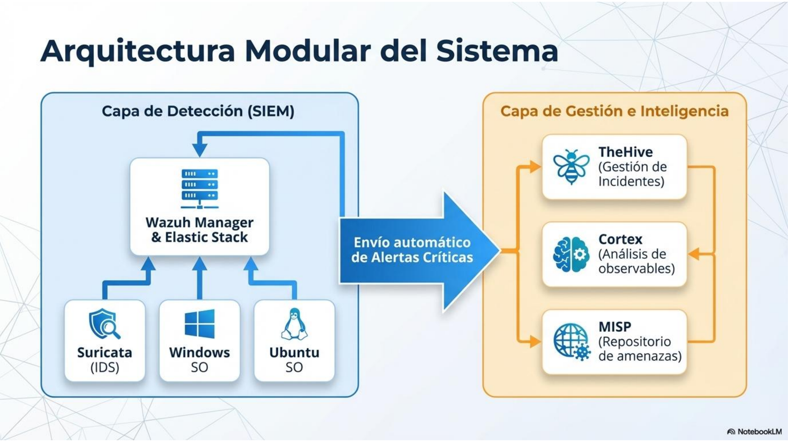
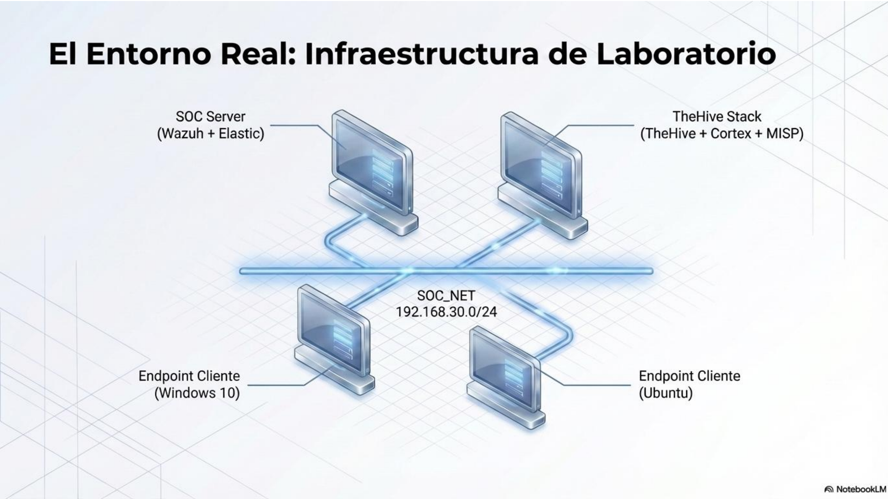
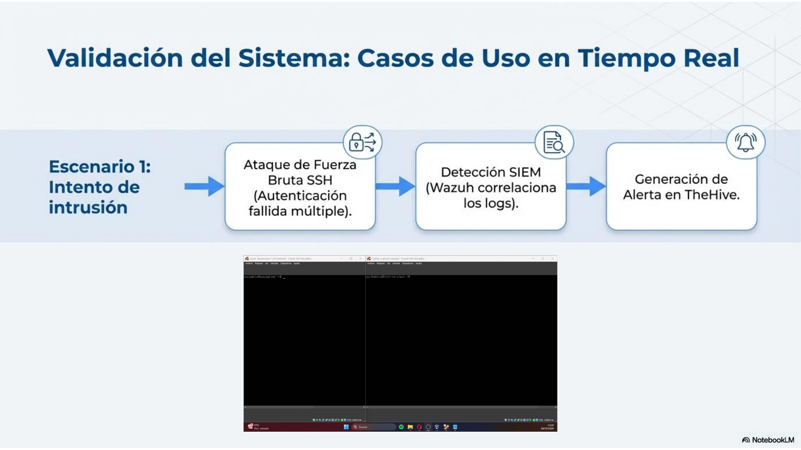
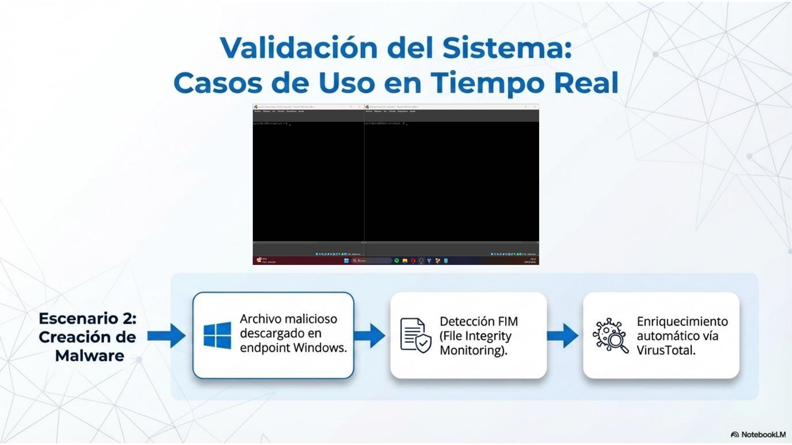
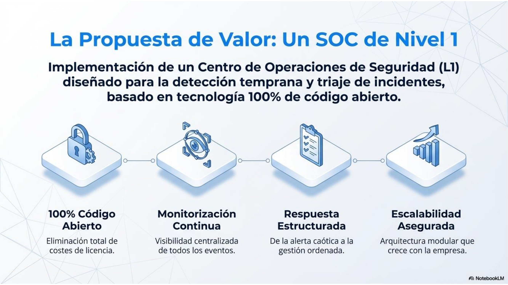
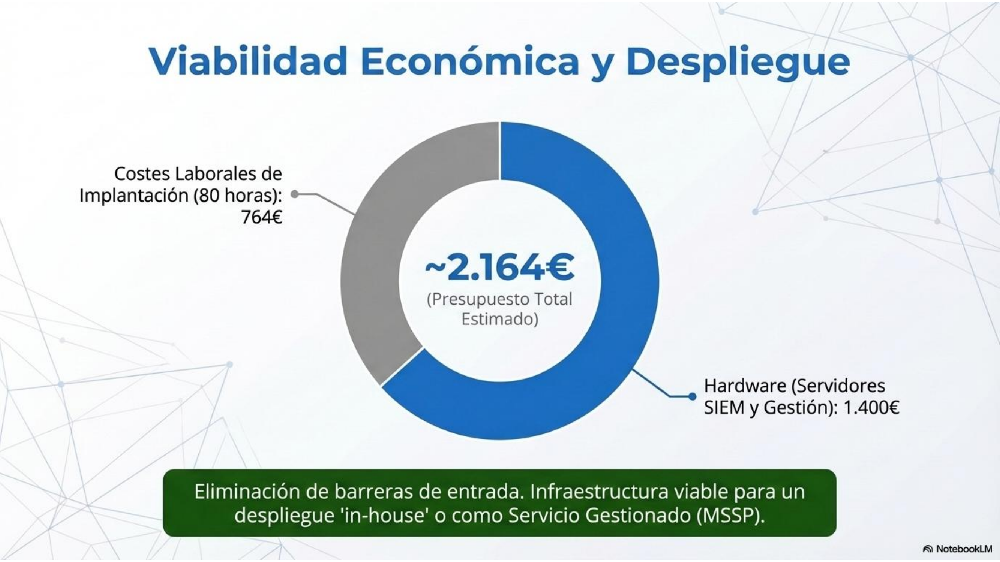
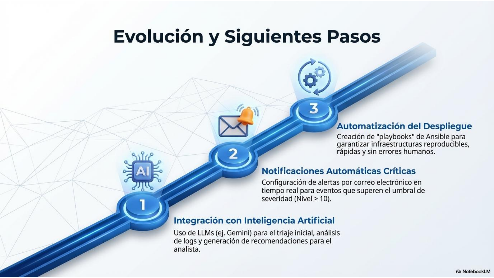

# TFC-ASIR: SOC L1 con Wazuh, TheHive, Cortex, MISP y Suricata


Proyecto de Fin de Ciclo de **ASIR** centrado en el **diseño, despliegue y validación de un Centro de Operaciones de Seguridad de Nivel 1 (SOC L1)** en un laboratorio virtualizado.

La solución combina **Wazuh + Elastic Stack** para la capa SIEM y **TheHive + Cortex + MISP** para la gestión de incidentes e inteligencia de amenazas. El objetivo es ofrecer una arquitectura **accesible, modular y escalable**, orientada a la detección temprana, triaje y gestión inicial de incidentes en entornos tipo PYME.

---

## Tabla de contenidos

- [Resumen del proyecto](#resumen-del-proyecto)
- [Objetivos](#objetivos)
- [Arquitectura](#arquitectura)
- [Laboratorio](#laboratorio)
- [Casos de uso validados](#casos-de-uso-validados)
- [Estructura del repositorio](#estructura-del-repositorio)
- [Documentación](#documentación)
- [Capturas](#capturas)
- [Tecnologías utilizadas](#tecnologías-utilizadas)
- [Líneas de mejora](#líneas-de-mejora)
- [Autor](#autor)

---

## Resumen del proyecto

Este repositorio documenta una infraestructura SOC L1 capaz de:

- centralizar eventos de seguridad de varios endpoints,
- detectar actividad sospechosa en host y red,
- generar alertas estructuradas en el SIEM,
- enriquecer eventos con contexto adicional,
- trasladar alertas relevantes a una plataforma de gestión de incidentes.

La arquitectura se validó mediante dos escenarios prácticos:

1. **Intento de acceso SSH con autenticación fallida** en el endpoint Ubuntu.
2. **Creación de un fichero monitorizado en Windows** con enriquecimiento vía VirusTotal.

---

## Objetivos

### Objetivo general

Diseñar e implementar una infraestructura funcional de **SOC de Nivel 1** basada en tecnologías open source, capaz de realizar monitorización, análisis inicial y gestión de incidentes en un entorno empresarial simulado.

### Objetivos específicos

- Implantar **Wazuh** como SIEM principal.
- Configurar **Elastic Stack** para almacenamiento y visualización.
- Integrar **TheHive** para la gestión estructurada de alertas e incidentes.
- Añadir capacidades de detección con **Suricata**, **FIM**, **YARA** y **VirusTotal**.
- Integrar **Cortex** y **MISP** para enriquecimiento e inteligencia de amenazas.
- Validar la solución mediante casos de uso reales de laboratorio.

---

## Arquitectura

La solución se divide en dos grandes bloques.

### 1) Capa SIEM y monitorización

- **Wazuh Manager**
- **Elasticsearch / Dashboard**
- **Agentes Wazuh** en Windows y Ubuntu
- **Suricata IDS**
- **FIM**
- **YARA**
- **Integración con VirusTotal**

### 2) Capa de gestión e inteligencia

- **TheHive**
- **Cortex**
- **MISP**

### Flujo operativo

```text
Endpoints -> Wazuh -> Correlación SIEM -> Alertas -> TheHive -> Cortex / MISP
```

### Diagrama de arquitectura



---

## Laboratorio

### Red interna

- **SOC_NET:** `192.168.30.0/24`

### Máquinas principales

| Máquina | Rol | IP |
|---|---|---:|
| `wazuh-server` | SIEM principal | `192.168.30.2` |
| `thehive-stack` | TheHive + Cortex + MISP | `192.168.30.3` |
| `win10-client` | Endpoint Windows monitorizado | `192.168.30.30` |
| `ubuntu-client` | Endpoint Ubuntu monitorizado | `192.168.30.40` |

### Esquema del entorno



---

## Casos de uso validados

### Caso 1. Intento de intrusión SSH

Se simulan varios intentos fallidos de autenticación SSH contra el endpoint Ubuntu.

**Resultado esperado:**
- Wazuh recoge los logs del sistema.
- El SIEM correlaciona eventos de autenticación fallida.
- Se generan alertas en Wazuh.
- Las alertas relevantes se envían a TheHive.



### Caso 2. Creación de fichero sospechoso en Windows

Se crea un fichero en un directorio monitorizado del endpoint Windows.

**Resultado esperado:**
- FIM detecta la creación del fichero.
- Wazuh genera una alerta.
- VirusTotal enriquece la información del archivo.
- TheHive recibe la alerta para su gestión.



---

## Estructura del repositorio

```text
TFC-ASIR-SOC-L1/
├── README.md
├── LICENSE
├── .gitignore
├── assets/
│   └── images/
│       ├── presentacion-06.png
│       ├── presentacion-08.png
│       ├── presentacion-09.png
│       └── presentacion-10.png
├── configs/
│   └── examples/
│       ├── docker-daemon.json
│       ├── ossec-agent-linux-snippet.xml
│       ├── ossec-agent-windows-snippet.xml
│       ├── ossec-manager-integration.xml
│       └── suricata-windows-localfile.xml
├── documentos/
│   ├── memoria.md
│   ├── memoria.pdf
│   ├── roadmap.md
│   ├── resumen-proyecto.md
│   ├── troubleshooting.md
│   └── use-cases.md
├── diagrams/
│   └── arquitectura-general.md
├── presentacion/
│   └── presentacion.pdf
├── scripts/
│   ├── custom-w2thive
│   └── custom-w2thive.py
└── ansible/
    └── README.md
```

---
## Cómo navegar este repositorio

Este repositorio está organizado para que puedas localizar rápido cada parte del proyecto:

- **`documentos/`**: memoria del proyecto, resumen, troubleshooting, roadmap y casos de uso.
- **`configs/examples/`**: fragmentos de configuración de Wazuh, Suricata y Docker usados como referencia.
- **`scripts/`**: scripts de integración entre Wazuh y TheHive.
- **`assets/images/`**: capturas e imágenes utilizadas en el README y en la presentación.
- **`presentacion/`**: versión en PDF de la presentación del proyecto.
- **`ansible/`**: base para una futura automatización del despliegue.
- **`diagrams/`**: apoyo documental sobre la arquitectura del sistema.

Si quieres una visión rápida del proyecto, empieza por este orden:
1. `README.md`
2. `documentoss/resumen-proyecto.md`
3. `documentos/use-cases.md`
4. `documentos/troubleshooting.md`
5. `documentos/memoria.pdf`

---
## Documentación

### Documentos principales

- [Memoria del proyecto en PDF](documentos/memoria.pdf)
- [Memoria del proyecto en Markdown](documentos/memoria.md)
- [Presentación del proyecto](presentacion/presentacion.pdf)
- [Resumen del proyecto](dococumentos/resumen-proyecto.md)
- [Casos de uso](documentos/use-cases.md)
- [Troubleshooting y lecciones aprendidas](documentos/troubleshooting.md)
- [Roadmap de evolución](documentos/roadmap.md)

---

## Capturas

### Propuesta de valor



### Viabilidad económica



### Próximos pasos



---

## Tecnologías utilizadas

| Categoría | Tecnologías |
|---|---|
| SIEM | Wazuh, Elastic Stack |
| Gestión de incidentes | TheHive |
| Enriquecimiento | Cortex, VirusTotal |
| Threat Intelligence | MISP |
| Detección en red | Suricata |
| Detección en endpoint | FIM, YARA |
| Virtualización | VirtualBox |
| Sistemas operativos | Ubuntu Server, Ubuntu Desktop, Windows 10 |

---

## Líneas de mejora

Las mejoras identificadas para evolución futura del proyecto son:

- integración de **IA** para análisis inicial de alertas,
- notificaciones automáticas por correo para alertas críticas,
- automatización del despliegue con **Ansible**,
- ampliación de fuentes de eventos,
- mejora del hardening y la reproducibilidad de la infraestructura.

---

## Autor

**Hugo Fernández Sande**  
Proyecto Fin de Ciclo ASIR  
Curso 2025-2026

---

## Nota

Este repositorio tiene un fin **académico y demostrativo**. Los fragmentos de configuración y scripts incluidos deben considerarse una **base de trabajo** y no una guía cerrada de despliegue en producción.
